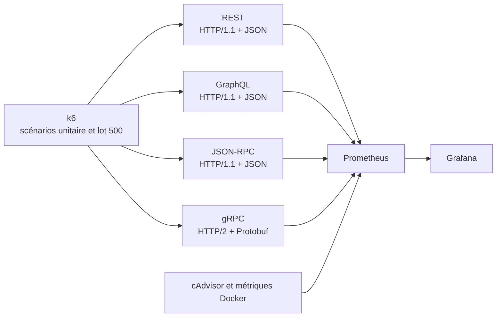

# Étude comparative du coût architectural des protocoles de communication pour l’ingestion à haute fréquence

**Auteur :** Hugo Vaillant  
**Cours :** MGL870 — Architecture logicielle  
**Format :** Article scientifique — Livrable 2  

## 1. Introduction

Les systèmes distribués qui ingèrent des événements à haute fréquence doivent traiter un grand nombre de messages tout en maintenant une latence faible et prévisible. Dans ce contexte, le choix du protocole de communication entre services ne constitue pas uniquement une décision d’implémentation. Il influence directement la consommation de ressources, le débit atteignable, la stabilité des temps de réponse, la facilité d’exploitation et la capacité des équipes à faire évoluer les contrats entre services.

Plusieurs styles de communication sont couramment utilisés pour ce type d’échange. REST, généralement associé à HTTP et JSON, privilégie la simplicité, l’interopérabilité et la lisibilité des messages. JSON-RPC conserve un format textuel tout en exprimant explicitement des appels de procédures. GraphQL apporte une interface de requêtage dynamique qui permet au client de sélectionner les données ou l’opération souhaitée, au prix d’un traitement supplémentaire du document de requête. gRPC s’appuie sur HTTP/2 et Protocol Buffers afin de fournir des contrats fortement typés et une sérialisation binaire efficace, mais introduit une chaîne d’outillage et d’exploitation plus spécialisée.

Ces choix correspondent à des compromis architecturaux différents. Un protocole textuel peut être plus facile à inspecter, à tester et à intégrer avec des outils génériques, mais son analyse et sa sérialisation peuvent consommer davantage de cycles processeur lorsque la charge augmente. À l’inverse, un protocole binaire peut réduire le volume de données et le coût de désérialisation, mais il impose des contrats plus stricts et rend l’observation directe du trafic moins immédiate. La question pertinente n’est donc pas de déterminer quel protocole est globalement supérieur, mais d’identifier les conditions dans lesquelles un compromis donné devient raisonnable.

Ce rapport présente une évaluation expérimentale de REST, GraphQL, JSON-RPC et gRPC dans un environnement contrôlé. Les quatre interfaces sont implémentées dans des micro-serveurs Rust qui réalisent le même traitement minimal : recevoir une structure représentant un tick de marché, la désérialiser en mémoire et retourner un accusé de succès. L’expérimentation compare un scénario de micro-message unitaire à un scénario d’ingestion par lots de 500 ticks. Les serveurs sont exécutés dans des conteneurs Docker soumis à une limite de `0,25` vCPU afin de faire apparaître les coûts de traitement des protocoles avant que la capacité de calcul ne soit masquée par une machine surdimensionnée.

Les résultats étudiés mettent en évidence un point de bascule plutôt qu’un classement universel. Pour les messages unitaires, REST obtient les meilleurs résultats dans la configuration observée, ce qui indique que les coûts associés à la pile gRPC et au multiplexage HTTP/2 peuvent dépasser le bénéfice de la sérialisation binaire lorsque le payload est très petit. Pour les lots de 500 ticks, gRPC conserve au contraire une latence et un débit nettement plus favorables que les alternatives textuelles, dont le coût de parsing devient dominant sous contrainte CPU. Cette opposition constitue le résultat architectural central de l’étude : le choix du protocole doit être conditionné par le volume de données par requête, la pression sur le processeur et la valeur accordée à l’opérabilité.

La contribution de ce travail est ainsi double. Premièrement, il fournit des mesures reproductibles sur un système volontairement réduit afin d’isoler le coût mécanique de la communication. Deuxièmement, il transforme ces mesures en une analyse de décision architecturale : quand la simplicité et la lisibilité des protocoles textuels restent-elles préférables, et à partir de quelle charge l’efficacité de gRPC justifie-t-elle la complexité supplémentaire de ses contrats et de son outillage? La portée des conclusions demeure liée à l’environnement expérimental et aux scénarios évalués; elles ne prétendent pas établir une supériorité générale d’un protocole.

## 2. Contexte et motivation

### 2.1. Contexte architectural

La communication inter-processus est une décision structurante dans les systèmes distribués. Même lorsque les services exécutent une logique métier simple, chaque requête traverse plusieurs couches : établissement ou réutilisation de la connexion, transport HTTP, encodage du message, transmission réseau, parsing, désérialisation et traitement applicatif. Le coût de ces couches devient significatif lorsque le système doit traiter un grand nombre de requêtes ou lorsqu’il dispose de ressources de calcul limitées.

Dans un système d’ingestion de ticks de marché, les messages sont généralement fréquents et doivent être traités rapidement. Un tick étudié dans ce projet contient quatre champs : un symbole, un prix, un volume et un horodatage. La structure est volontairement minimale. Cette caractéristique permet de distinguer deux situations architecturales importantes :

- un message individuel dont le contenu est faible par rapport au coût fixe du protocole;
- un lot de nombreux messages où le coût de sérialisation, de parsing et de transfert devient proportionnellement plus important.

REST représente la baseline de l’étude. Son modèle orienté ressource, combiné à HTTP et JSON, est largement compris par les bibliothèques, les outils de diagnostic et les équipes d’exploitation. JSON-RPC propose une représentation orientée appel de procédure, tout en conservant les propriétés générales d’un format textuel. GraphQL ajoute une couche de requête dynamique et un moteur capable d’interpréter la structure de la demande. gRPC suit une approche différente : le contrat est défini dans un fichier Protocol Buffers, le message est sérialisé en binaire et l’échange utilise HTTP/2.

Ces différences ne concernent donc pas uniquement le format des octets échangés. Elles modifient également la manière dont les services sont développés, versionnés, testés, observés et débogués. Les formats textuels facilitent habituellement l’inspection manuelle des requêtes et l’utilisation d’outils HTTP génériques. gRPC peut améliorer l’efficacité d’exécution et formaliser davantage les interfaces, mais nécessite des outils adaptés au contrat `.proto`, au transport HTTP/2 et au décodage des messages binaires. La performance observée est par conséquent un attribut parmi plusieurs autres dans la décision architecturale.

### 2.2. Motivation de l’étude

Le choix d’un protocole de communication interne est parfois présenté comme une opposition simplifiée entre la facilité d’utilisation de REST et la performance de gRPC. Une telle présentation masque toutefois les conditions qui déterminent réellement le résultat. Le coût fixe d’un appel, le volume du payload, le degré de concurrence et la capacité CPU disponible peuvent inverser le classement entre deux solutions. De même, GraphQL peut être avantageux lorsque la flexibilité de requêtage réduit les échanges inutiles, mais cette flexibilité a un coût de parsing et d’exécution qui peut devenir défavorable pour une opération d’ingestion répétitive.

La motivation principale de ce projet est donc de rendre ces compromis observables dans un environnement contrôlé. L’étude retire volontairement la logique métier et l’accès à une base de données afin de concentrer l’analyse sur les couches de communication et de sérialisation. Les quatre serveurs sont écrits en Rust, puis exécutés dans des conteneurs distincts. La limite de `0,25` vCPU imposée à chaque serveur crée une contrainte de calcul commune et permet d’observer le comportement des protocoles lorsqu’ils approchent la saturation. Prometheus, Grafana et cAdvisor fournissent les mesures nécessaires pour mettre en relation la latence et le débit avec l’utilisation des ressources.

Cette démarche répond à un besoin de raisonnement architectural fondé sur des preuves. Les résultats doivent permettre de dépasser deux généralisations opposées mais également insuffisantes : considérer que le texte est toujours assez efficace parce que les messages sont petits, ou considérer que le binaire est toujours préférable dès qu’un système est soumis à une charge élevée. L’objectif est plutôt de caractériser les conditions qui rendent chaque décision défendable et d’expliciter les coûts non fonctionnels qui accompagnent cette décision.

### 2.3. Périmètre de l’étude

L’étude porte sur la communication est-ouest entre un générateur de charge et un micro-serveur d’ingestion. Elle mesure principalement la latence de réponse, le débit, le taux d’erreur et la consommation de ressources observée pendant les scénarios. Elle ne cherche pas à évaluer la qualité d’un système financier complet, la performance d’une base de données, la résilience à des pannes distribuées, la sécurité des transports ou la facilité d’évolution sur plusieurs années.

Cette délimitation est nécessaire pour interpréter correctement les résultats. Le protocole expérimental permet d’isoler un coût mécanique utile à la décision, mais il ne capture pas tous les facteurs qui interviennent dans un système de production. Les conclusions du rapport porteront donc sur le compromis entre efficacité d’exécution et coût opérationnel dans le scénario d’ingestion étudié, et non sur une recommandation universelle applicable à toutes les architectures.

## 3. Problème architectural

L’architecte logiciel doit choisir un style de communication capable de soutenir la charge prévue sans introduire un coût opérationnel disproportionné. Cette décision est difficile parce que les attributs de qualité concernés évoluent dans des directions différentes.

D’un côté, REST, JSON-RPC et GraphQL offrent une représentation textuelle ou une interface accessible à un large éventail de clients et d’outils. Cette accessibilité réduit le coût d’intégration et facilite l’observation : une requête peut être inspectée avec des outils HTTP courants, et un incident peut souvent être reproduit sans connaître un schéma binaire spécialisé. Ces avantages sont particulièrement importants pour le diagnostic, la maintenance et l’évolution de systèmes composés de services développés par plusieurs équipes.

De l’autre côté, l’encodage textuel et l’analyse des structures JSON nécessitent du travail processeur et produisent généralement davantage d’octets que l’encodage binaire. GraphQL ajoute à ce coût la lecture et l’exécution d’une requête dynamique. Sous une contrainte CPU forte, ces opérations peuvent réduire le débit et augmenter les percentiles élevés de latence. gRPC vise précisément à réduire une partie de cette surcharge grâce à Protocol Buffers et à un contrat fortement défini, mais cette efficacité potentielle s’accompagne d’un couplage plus explicite entre les producteurs et les consommateurs du contrat, d’une dépendance à un outillage particulier et d’une observabilité moins immédiate du trafic brut.

Le problème architectural étudié peut donc être formulé ainsi : **comment choisir entre la simplicité opérationnelle et la flexibilité des protocoles textuels, d’une part, et l’efficacité mécanique ainsi que le typage contractuel de gRPC, d’autre part, lorsque la taille des messages et la contrainte CPU varient?**

Une réponse fondée uniquement sur les caractéristiques théoriques des protocoles serait insuffisante. Le coût réel dépend de l’interaction entre le format du message, le transport, l’implémentation, la charge imposée et les ressources disponibles. Il est notamment possible qu’un protocole binaire ne compense pas ses coûts fixes pour un micro-message, alors qu’il devienne déterminant lorsque plusieurs centaines d’objets sont regroupés dans une même requête. Le problème n’est donc pas de rechercher le protocole le plus rapide dans l’absolu, mais d’identifier le domaine de validité de chaque compromis architectural.

Dans cette étude, la question est rendue observable par deux scénarios contrôlés : l’ingestion d’un tick par requête et l’ingestion d’un lot de 500 ticks par requête. Les mêmes structures de données et le même traitement applicatif minimal sont utilisés pour les quatre interfaces. Les différences constatées peuvent ainsi être interprétées principalement à la lumière des choix de transport, d’interface et de sérialisation, tout en tenant compte des limites de l’environnement expérimental.

Le rapport cherchera donc à établir une conclusion conditionnelle : les protocoles textuels peuvent demeurer une décision raisonnable lorsque la simplicité, l’interopérabilité et l’opérabilité dominent et que le volume de données par requête est faible; gRPC peut devenir préférable lorsque la charge utile est suffisamment importante et que la contrainte CPU rend le coût du parsing textuel déterminant. Cette conclusion devra être soutenue par les mesures de latence, de débit et de ressources, puis nuancée par l’analyse des limites et des coûts architecturaux qui ne sont pas entièrement mesurables dans ce benchmark.

## 4. Questions de recherche et objectifs

### 4.1. Question de recherche principale

La question centrale de cette étude est la suivante :

> **Dans un environnement d’ingestion soumis à une contrainte CPU, à partir de quel volume de charge utile les gains d’efficacité mécanique de gRPC justifient-ils son coût supplémentaire en opérabilité et en couplage contractuel par rapport à REST, GraphQL et JSON-RPC?**

Cette formulation décrit une décision architecturale conditionnelle. Elle ne cherche pas à établir qu’un protocole est toujours supérieur aux autres. Elle cherche plutôt à relier le choix du protocole à deux variables indépendantes qui peuvent modifier le compromis : la taille du message et la pression exercée sur les ressources de calcul.

### 4.2. Questions secondaires

L’analyse est structurée autour de quatre questions secondaires :

1. **Performance :** comment les protocoles se comparent-ils en matière de latence p50, p95 et p99, de débit et de taux d’erreur lorsque la charge augmente?
2. **Taille du payload :** le classement observé pour un tick unitaire est-il différent de celui observé lorsqu’une requête contient 500 ticks?
3. **Efficacité matérielle :** l’utilisation CPU observée permet-elle d’expliquer les écarts de performance entre les formats textuels et la sérialisation binaire?
4. **Décision architecturale :** dans quelles conditions les gains de performance de gRPC compensent-ils les coûts d’opérabilité, de couplage de contrat et d’outillage spécialisé?

### 4.3. Hypothèses étudiées

Les hypothèses suivantes guident l’interprétation des mesures :

- **H1 — coût des micro-messages :** pour un tick unitaire, le coût fixe de la pile gRPC et du transport HTTP/2 peut réduire ou annuler l’avantage attendu de Protocol Buffers; REST peut donc obtenir une latence ou un débit supérieur dans ce scénario.
- **H2 — effet de la taille :** pour un lot de 500 ticks, le coût du parsing et de la désérialisation des représentations JSON devient proportionnellement plus important, ce qui devrait favoriser gRPC sous contrainte CPU.
- **H3 — saturation :** à mesure que la charge augmente, les protocoles qui consomment davantage de CPU devraient présenter une dégradation plus importante de leurs percentiles élevés de latence et de leur débit utile.
- **H4 — compromis architectural :** même lorsqu’il obtient les meilleures performances, gRPC ne constitue pas automatiquement la meilleure décision; son adoption n’est justifiable que si le gain mesuré est suffisamment important pour compenser le coût d’exploitation et de gestion des contrats.

Ces hypothèses ne sont pas des affirmations universelles sur les protocoles. Elles sont des prédictions limitées aux implémentations, aux charges et aux contraintes décrites dans ce rapport. L’expérimentation peut les confirmer, les contredire ou montrer qu’elles ne sont pas suffisamment étayées par les mesures disponibles.

### 4.4. Objectifs opérationnels

Pour répondre à ces questions, le projet poursuit quatre objectifs :

1. comparer les quatre interfaces avec un traitement applicatif commun et minimal;
2. mesurer l’effet de deux tailles de charge utile représentatives, un tick et 500 ticks;
3. relier les mesures de latence et de débit à l’utilisation CPU observée dans les conteneurs;
4. formuler une recommandation conditionnelle, explicite sur ses preuves, ses hypothèses et ses limites.

La réponse finale sera considérée comme solide seulement si elle distingue les observations directement mesurées des explications causales et des implications architecturales. Par exemple, une latence plus élevée constitue une observation; l’attribuer au parsing JSON constitue une interprétation qui doit être soutenue par les mesures de ressources et par la compréhension du chemin d’exécution.

## 5. Travaux connexes et état de l’art

### 5.1. Les styles d’interface comparés

REST est étudié ici comme une application du style architectural REST à travers une interface HTTP orientée ressource. Le travail de Fielding sur les styles architecturaux du Web met en avant les contraintes qui favorisent la séparation des responsabilités, la visibilité des interactions et l’évolutivité de systèmes distribués [1] (https://ics.uci.edu/~fielding/pubs/dissertation/top.htm). Dans le benchmark, REST fournit une baseline pragmatique : une requête `POST` transporte un objet JSON vers une ressource d’ingestion et le serveur répond par un statut HTTP. Cette baseline ne représente pas toutes les architectures REST possibles, mais elle fournit une référence textuelle et largement outillée.

JSON-RPC 2.0 décrit une convention légère d’appel de procédures à distance au moyen d’objets JSON contenant notamment une version, une méthode, des paramètres et un identifiant de corrélation [2] (https://www.jsonrpc.org/specification). Ce modèle réduit l’ambiguïté entre une opération métier et une ressource, tout en conservant les coûts de représentation et d’analyse du JSON. Dans cette étude, JSON-RPC permet donc d’isoler l’effet d’une interface orientée action sans changer de format de sérialisation textuel.

GraphQL définit un langage de requête et un environnement d’exécution permettant au client de demander une forme précise de résultat [3] (https://spec.graphql.org/). Cette flexibilité peut réduire les échanges inutiles dans des systèmes où les besoins de lecture sont variables. Elle introduit toutefois une étape d’analyse et d’exécution de la requête. Le cas étudié est volontairement plus contrôlé que les usages généraux de GraphQL : chaque scénario utilise une mutation d’ingestion connue à l’avance. Le protocole conserve néanmoins le coût structurel de l’analyse du document GraphQL, ce qui en fait une alternative pertinente pour l’étude du compromis entre flexibilité et coût de traitement.

gRPC est également une interface orientée appel de procédure, mais elle formalise davantage le contrat entre le client et le serveur. Le service et ses opérations sont décrits explicitement dans un contrat partagé, puis utilisés pour générer les artefacts nécessaires aux clients et aux serveurs [4]. Cette approche peut réduire l’ambiguïté des interfaces et renforcer la vérification des contrats, mais elle augmente aussi la dépendance entre les équipes et l’outillage de génération. Dans le benchmark, gRPC constitue donc l’alternative RPC fortement contractuelle face à JSON-RPC, qui conserve un contrat textuel et une structure de message inspectable directement.

### 5.2. Sérialisation et transport

Les protocoles textuels utilisés dans l’étude représentent les messages au format JSON. JSON est lisible et facilement pris en charge par de nombreux environnements, mais cette représentation doit être parcourue et convertie en structures natives à chaque requête. Le coût dépend du contenu, de l’implémentation du parseur et de la pression CPU. Il ne peut donc pas être déduit uniquement de la taille théorique du document.

gRPC repose sur des contrats définis avec Protocol Buffers et utilise HTTP/2 pour le transport. La documentation officielle de gRPC décrit les appels RPC, les contrats de service, la génération de code et les mécanismes de communication associés [4](https://grpc.io/docs/what-is-grpc/core-concepts/). La documentation de Protocol Buffers décrit pour sa part une représentation structurée et compacte destinée à être encodée et décodée par des implémentations générées [5](https://protobuf.dev/programming-guides/overview/). Ces mécanismes rendent plausible un avantage pour les messages volumineux, mais ils ne suppriment pas les coûts fixes du transport, de la gestion des connexions et de la pile d’exécution. C’est précisément pourquoi l’étude oppose des messages unitaires à des lots importants.

Les travaux sur les systèmes de données distribuées rappellent également qu’un compromis de performance ne doit pas être séparé des autres propriétés du système. Kleppmann souligne que les choix de représentation, de transport et d’organisation des données doivent être évalués selon la charge de travail et les exigences du système, plutôt qu’à partir d’une caractéristique isolée [6](https://dataintensive.net/). Cette perspective soutient l’approche retenue ici : la performance est analysée avec la contrainte CPU, la taille des messages et les coûts d’exploitation, et non comme un classement abstrait des technologies.

### 5.3. Positionnement de la présente étude

La littérature et la documentation permettent de comprendre les propriétés annoncées des protocoles, mais elles ne suffisent pas à prédire le classement obtenu par quatre implémentations concrètes sous une limite de `0,25` vCPU. Le présent travail complète donc ces sources par une expérience contrôlée. Sa contribution n’est pas de proposer un nouveau protocole ni une nouvelle technique de sérialisation. Elle consiste à examiner une décision architecturale dans un scénario reproductible où la taille du payload et la contrainte de calcul sont explicitement manipulées.

Le benchmark se distingue également d’une comparaison fonctionnelle. Les interfaces ne sont pas évaluées selon le nombre de fonctionnalités proposées, la richesse de l’écosystème ou la popularité de leur communauté. Elles sont comparées selon des scénarios d’ingestion et des attributs de qualité mesurables. Les propriétés de flexibilité, d’opérabilité et de couplage sont utilisées pour interpréter les conséquences architecturales des résultats, mais elles ne sont pas présentées comme des mesures quantitatives équivalentes à la latence ou au débit.

Les sources citées dans cette section seront reprises et complétées dans la section 15, qui constituera la bibliographie finale du rapport.

## 6. Système et contexte étudiés

### 6.1. Système expérimental

Le système étudié est un micro-serveur d’ingestion implémenté en Rust. Il expose quatre interfaces séparées, chacune étant exécutée dans un conteneur Docker distinct : REST, GraphQL, JSON-RPC et gRPC. Les quatre conteneurs sont construits à partir du même projet et utilisent le même modèle conceptuel de données. Cette organisation permet de comparer les interfaces dans des processus séparés tout en appliquant une limite de ressources identique à chaque variante.

Le modèle de données `Tick` contient quatre attributs : `symbol` de type chaîne, `price` de type flottant, `volume` de type entier non signé et `timestamp` de type entier non signé. Le contrat Protocol Buffers représente les mêmes informations dans le message `TickMessage`. Pour les scénarios par lots, les variantes textuelles reçoivent un tableau de ticks et gRPC reçoit un message `TickList` contenant un champ répété `ticks`.

Le traitement applicatif est volontairement minimal. Chaque endpoint reçoit le message, le désérialise vers la structure attendue et retourne un succès. Aucune base de données, logique métier, validation financière ou opération d’écriture persistante n’est exécutée. Ce choix contrôle le bruit expérimental et concentre la comparaison sur le transport, l’analyse de l’interface et la sérialisation. Il signifie aussi que les résultats ne décrivent pas la performance d’une application financière complète; ils décrivent le coût relatif de la frontière de communication dans les conditions étudiées.

### 6.2. Interfaces et points d’entrée

Les points d’entrée évalués sont les suivants :

| Variante | Transport et représentation | Opérations évaluées |
| --- | --- | --- |
| REST | HTTP/1.1 et JSON | `POST /api/ticks`, `POST /api/ticks/batch` |
| GraphQL | HTTP/1.1, document GraphQL et variables JSON | mutations `ingestTick` et `ingestTickBatch` sur `/graphql` |
| JSON-RPC | HTTP/1.1 et objets JSON-RPC 2.0 | méthodes `ingest_tick` et `ingest_tick_batch` sur `/jsonrpc` |
| gRPC | HTTP/2 et Protocol Buffers | `IngestTick` et `IngestTickBatch` sur `TickIngestion` |

Les signatures des opérations sont alignées autant que le permettent les modèles des protocoles. Dans chaque cas, le scénario unitaire transmet un tick et le scénario par lots transmet 500 ticks. Le générateur de charge utilise les mêmes valeurs de données afin d’éviter que les différences de contenu ne deviennent une variable expérimentale supplémentaire.

### 6.3. Déploiement et observabilité

Le déploiement comprend quatre services évalués, un générateur de charge k6 pour les scénarios, Prometheus pour la collecte des métriques, cAdvisor et un composant de métriques Docker pour l’observation des conteneurs, ainsi que Grafana pour l’exploration visuelle. Chaque serveur dispose d’une limite de `0,25` vCPU et de 512 MiB de mémoire. La limite CPU est commune aux variantes et représente une contrainte volontairement stricte : elle augmente la probabilité que le coût de parsing, de sérialisation ou de traitement du transport apparaisse dans les mesures.

Le générateur k6 enregistre la durée des requêtes, le nombre de requêtes, les erreurs et le taux d’erreur avec des métriques séparées par protocole. Les métriques système permettent de relier ces mesures applicatives à l’utilisation des conteneurs. La figure suivante documente les composants et les flux principaux du dispositif. Le fichier source PlantUML versionné est disponible dans [`docs/figures/architecture.puml`](figures/architecture.puml).

**Figure 1 —** Architecture du banc d’essai et flux d’observabilité. Les quatre services évalués sont isolés dans des conteneurs soumis à la même limite CPU; k6 mesure le comportement applicatif et Prometheus/Grafana relient ces mesures aux ressources consommées.

### 6.4. Contexte d’interprétation

Le système n’a pas été conçu pour simuler toutes les conditions d’un environnement de production. Il sert de banc d’essai contrôlé pour une question ciblée : comment la taille de la charge utile modifie-t-elle le compromis entre formats textuels et sérialisation binaire lorsque le serveur est limité en CPU? La séparation des conteneurs réduit les interférences directes entre les variantes, mais l’exécution demeure influencée par l’hôte, la virtualisation réseau et l’implémentation des bibliothèques utilisées.

Cette distinction entre système étudié et système de production est essentielle. Le benchmark fournit des preuves sur le coût de la frontière d’appel dans un scénario minimal. Il ne permet pas, à lui seul, de conclure sur la sécurité, la résilience, l’évolution de contrats à long terme, la facilité de recrutement ou le coût total d’exploitation. Ces dimensions seront reprises dans l’analyse des compromis et dans les menaces à la validité.

